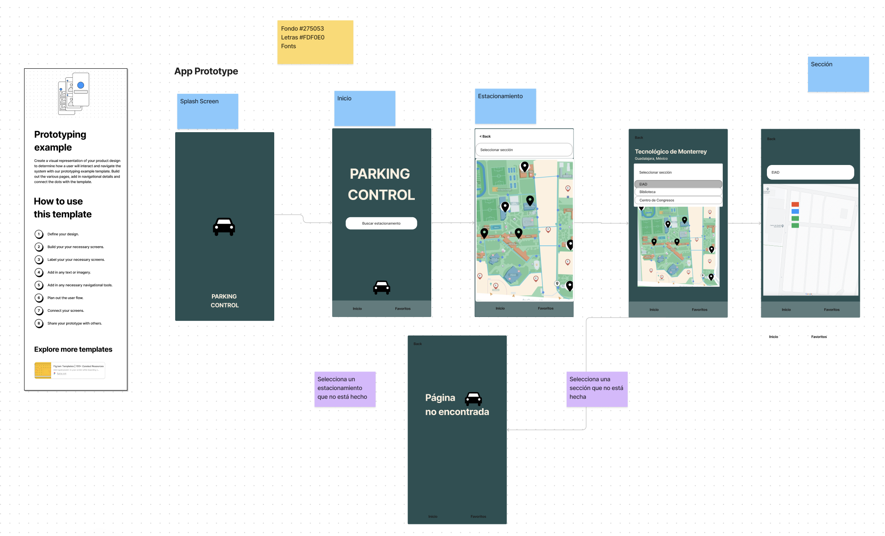

# Parking Control (final version)

Parking Control app is an iOS appllication that lets the user monitor a parking lot status in realtime. The objective of the application is to provide a visual representation of the available and unavailable parking spots during rush hours.

The application bases it functionality in IoT technology that connects to a hardware system (an ultrasonic sensor system) enabling real-time object proximity detection. It seamlessly transmits this data to a Firebase real-time database, which is then accessed by the app to provide users with a user-friendly interface for monitoring sensor information.

You can see a video of the project in the next link:
- [Link to video](https://www.youtube.com/watch?v=et4xBLD6CM0)

Next, is a skech of the app made in figma to brainstorm the main navigation of the application

## 

### Main Dependencies
<code>npm install @react-navigation/stack</code>
<code>npm install @react-navigation/native</code>
<code>npx expo install react-native-screens</code>
<code>npx expo install react-native-safe-area-context</code>
<code>npm i react-native-vector-icons</code>

## 

### Acknowledgments
This project could not have been made possible without the help of my amazing team:
- Gabriela Medina and a special mention to Paola Ramos and Monica Escobedo :D
